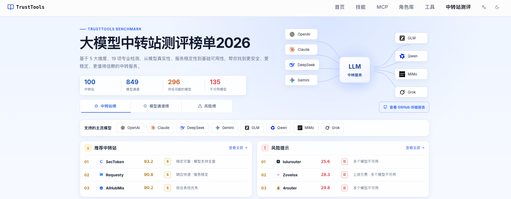

# 大模型中转站研究与测评报告（2026）

**语言：** 中文 | [English](./README_EN.md)

对 100 个大模型中转站的黑盒实测：19 项检测器覆盖基础能力、站点安全、模型一致性、响应完整性、服务稳定性五个维度，共形成 849 个模型—中转站测试组合。849 个测试组合中，135 个实际不可用（涉及 45 个站点），296 个存在至少一项模型真实性异常证据（涉及 75 个站点），110 个存在隐藏指令注入，239 个存在明显延迟异常。

在线排行榜：<https://ai.trusttools.cn/benchmark>

完整报告：见下方「报告下载」，含完整方法论与全部 100 个站点的评分明细

---

## 报告下载

| 文档 | 语言 | 版本    | 说明 |
| --- | --- | --- | --- |
| [LLM-Relay-Services-Research-and-Assessment-Report-2026-ZH.pdf](./LLM-Relay-Services-Research-and-Assessment-Report-2026-ZH.pdf) | 中文 | 2026 | 中文完整版报告 |
| [LLM-Relay-Services-Research-and-Assessment-Report-2026-EN.pdf](./LLM-Relay-Services-Research-and-Assessment-Report-2026-EN.pdf) | English | 2026 | 完整版英文报告 |

## 测评概况

| 项目 | 内容 |
| --- | --- |
| 受测站点 | 100 个，国内运营与海外运营各 50%，覆盖企业与非企业运营主体 |
| 受测模型 | 26 类主流模型，覆盖 OpenAI、Anthropic、DeepSeek、智谱（Z.AI）、Qwen、Gemini、MiMo、xAI 等厂商 |
| 测试组合 | 849 个「模型—中转站」组合 |
| 检测体系 | 5 个维度、19 项黑盒检测器 |
| 数据采集时间 | 2026 年 9 月 |

## 检测器一览

将中转站视为黑盒系统，针对特定目标构造测试输入，把实际观测到的请求、响应与服务行为与目标模型或协议规范的预期行为对比；仅当行为差异稳定、可复现，且多个相互独立的检测手段结论一致时，才判定相应环节异常。测评框架以模型为基本单位编排检测策略，相同模型在统一配置、统一方法下完成测试，以保证站点之间的结果可横向比较。

| 一级维度 | 检测器 | 检测内容 | 适用范围 |
| --- | --- | --- | --- |
| 基础能力 | 协议可用性探测 | 三大主流协议可用性、连通性检测。 | 全部模型 |
| | 可用模型检测 | 核对模型列表与接口实际可调用模型数量。 | 全部模型 |
| 站点安全 | TLS 证书检测 | 检查证书有效性、域名匹配与证书完整性。 | 全部模型 |
| | 隐藏指令注入检测 | 检查模型返回的 usage 是否包含了显著超出输入的内容。 | 全部模型 |
| | 已知投毒中转站 | 将站点与公开威胁情报中的历史投毒记录关联比对。 | 全部模型 |
| 模型一致性 | 随机 token 行为指纹 | 一系列模型随机指纹的对比验证，识别与官方指纹的偏离程度。 | 模型思考模式可手动关闭 |
| | 延迟双峰检测 | 分析延迟分布的双峰特征，识别多后端、多供应商动态路由切换。 | 全部模型 |
| | 模型身份自识别检测 | 通过身份探针与响应 model 字段交叉验证模型自报身份。 | 全部模型 |
| | JSON 输出能力检测 | 验证结构化输出参数能否被正确透传并由目标模型执行。 | 原生支持 JSON 结构化输出的模型 |
| | Tokenizer 特殊 token 指纹 | 利用模型家族特有的特殊 Token 行为验证底层 Tokenizer 是否一致。 | qwen、deepseek、glm 系列模型 |
| | 响应模型一致性检测 | 核对响应体 model 字段与请求模型的一致性。 | 全部模型 |
| | 结构化工具调用检测器 | 强制工具调用探针，校验工具类响应是否符合 Anthropic Messages 约定。 | Claude 系列模型 |
| | Usage 一致性 | 对比不同长度输入 Token 使用量与官方基线的差异及规律。 | Claude、DeepSeek、GLM 等拥有基线参考的模型 |
| 响应完整性 | OpenAI 响应骨架规范检测 | 按协议规范校验 OpenAI 兼容接口响应的结构特征与必需字段。 | 兼容 OpenAI 协议接口的模型 |
| | Anthropic 响应骨架规范检测 | 按协议规范校验 Anthropic Messages 响应的结构特征与必需字段。 | 兼容 Anthropic Messages 协议接口的模型 |
| | 错误响应泄露检测 | 校验错误响应的规范性与敏感信息泄露情况。 | 全部模型 |
| | 上下文完整性检测 | 通过预埋标记码验证长上下文是否被完整传递，发现压缩与截断行为。 | 全部模型 |
| 服务稳定性 | 请求延迟稳定性检测 | 以 P95 延迟为核心指标持续监测响应速度与尾部延迟。 | 全部模型 |
| | 请求成功率检测 | 统计观测周期内请求成功与失败事件，衡量服务可用程度。 | 全部模型 |
>[!TIP]
> 本表所列检测器构成与适用范围为本次测评执行时的实际状态，后续检测规则可能持续优化迭代，适用范围、检测方式亦可能随之调整，以最新版本为准。不同模型在调用形式与参数支持上存在差异，各检测器仅在其适用范围内执行。

## 综合排名 TOP 10

| 排名 | 站点 | 站点安全 | 模型一致性 | 响应完整性 | 服务稳定性 | 基础能力 | 综合评分 | 等级 |
| --- | --- | --- | --- | --- | --- | --- | --- | --- |
| 1 | [sectoken](https://sectoken.cqcyht.com) | 100.0 | 96.0 | 100.0 | 86.0 | 97.8 | 93.2 | S |
| 2 | [requesty](https://www.requesty.ai/) | 100.0 | 87.2 | 91.5 | 85.6 | 99.0 | 90.8 | S |
| 3 | [aisa](https://auth.aisa.one) | 97.5 | 89.2 | 100.0 | 86.5 | 94.5 | 90.4 | S |
| 4 | [aihubmix](https://aihubmix.com) | 100.0 | 93.8 | 99.2 | 92.2 | 98.3 | 90.2 | S |
| 5 | [302-ai](https://302.ai) | 99.1 | 87.5 | 99.1 | 77.4 | 98.4 | 89.8 | A |
| 6 | [ohmygpt](https://www.ohmygpt.com) | 100.0 | 94.1 | 100.0 | 84.3 | 93.3 | 89.4 | A |
| 7 | [canalapi](https://www.canalapi.com) | 100.0 | 98.0 | 100.0 | 70.0 | 70.0 | 88.6 | A |
| 8 | [dmxapi](https://dmxapi.com) | 100.0 | 92.4 | 96.7 | 79.2 | 92.0 | 88.4 | A |
| 9 | [opencode-go](https://opencode.ai) | 94.3 | 88.2 | 96.2 | 82.1 | 87.1 | 86.9 | A |
| 10 | [nextbit](https://www.nextbit256.com) | 100.0 | 96.8 | 93.3 | 87.5 | 100.0 | 86.7 | A |

## 边界与免责声明

- 本次检测在测试端以黑盒方式完成，仅能观察接口、请求参数、响应内容、Token 使用量与错误信息等外部可观测信息，无法直接获取中转站内部的路由策略、上游供应商信息与调用日志，部分结果属于基于外部行为特征的间接判断。
- 对于模型偷换等高风险结论，均以多个相互独立的检测结果交叉验证为前提，以降低模型版本差异、服务端配置、采样随机性造成的误判。
- Token Usage、响应延迟等属于侧信道信息，可能同时受协议转换、请求预处理、上游实现、网络链路与负载等因素影响，仅用于发现异常模式与辅助判断，不单独作为确定性证明。
- 「未发现异常」仅表示在本次测试范围与条件下未观察到足以支持该风险判断的证据，不代表确认不存在该风险；评分与等级不构成对任何站点「绝对安全」或「绝对可信」的认证。
- 结果反映 2026 年 9 月数据采集时段内的服务表现，站点可能因模型版本更新、上游供应商变化、路由策略调整或运营策略变化而改变；采用多上游动态路由的站点，同一模型在不同时间也可能表现出不同特征。
- 本报告仅用于技术研究与开发者选型参考，不构成商业推荐或投资建议。站点名称、商标归各自所有者所有。

## 参考链接

1. <https://www.alphaxiv.org/abs/2604.08407>
2. <https://www.tomshardware.com/tech-industry/artificial-intelligence/chinese-grey-market-sells-claude-api-access-at-90-percent-off-through-proxy-networks-that-harvest-user-data>
3. <https://arxiv.org/pdf/2607.10252>
4. <https://zenodo.org/records/21278557>
5. <https://platform.claude.com/docs/en/api/messages>
6. <https://developers.openai.com/api/reference/resources/responses/methods/create>
7. <https://developers.openai.com/api/reference/resources/chat>
8. <https://github.com/canarybyte/veridrop>
9. <https://github.com/Mohamed7415/fpverify>
10. <https://x.com/shoucccc/status/2098169782541631871>
11. <https://apito.ai/zh/blog/getting-started/how-to-verify-claude-api-authenticity-fingerprint-detection>
12. <https://transformers.run/c2/2021-12-11-transformers-note-2/>
13. <https://github.com/october-coder/api-check>
